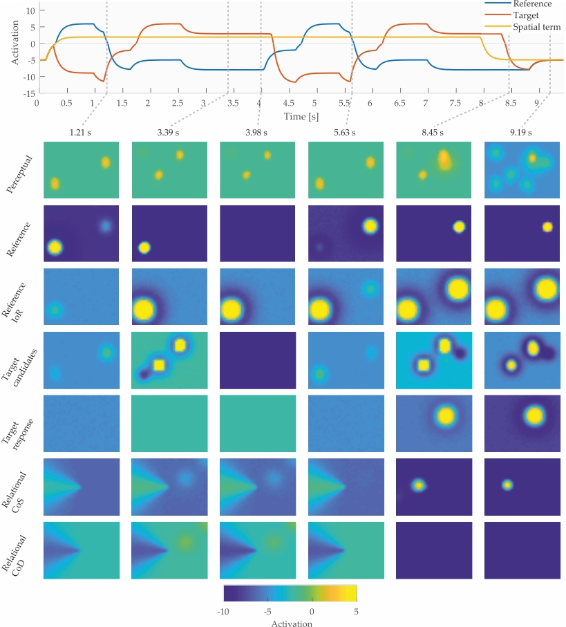

# Tools for generating figures and videos from CEDAR time series data

Requires `obliqueview` by John Barber, available on MATLAB Central.
Requires `export_fig` by Yair Altman, available on MATLAB Central.

This code enables generating videos or static figures based on data exported from
[CEDAR](http://cedar.ini.rub.de), a software framework for creating and simulating 
cognitive architectures based on dynamic neural fields. See an example figure below and 
see folder `doc_images` for a video generated using this code.

If you only need a way to conveniently import CEDAR data into MATLAB, the function
`cedarread` can also be used independently of the rest of the code.

#### Note

The code works well, but was implemented quick and dirty (except for `cedarread`), so it is not
very beautiful. I hope to get around to refactoring and making it a little more accessible in the future.

---

